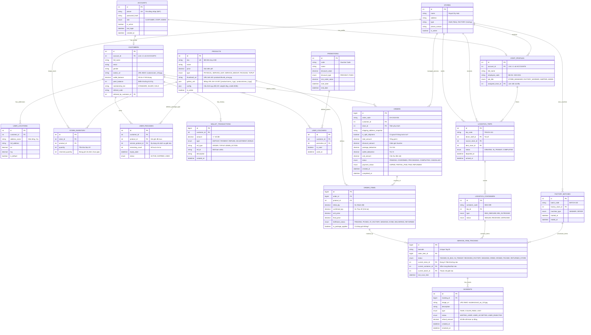

# Database ERD

```mermaid
erDiagram
    %% ==========================================
    %% NHÓM 1: ĐỊNH DANH & HỒ SƠ (IDENTITY & PROFILES)
    %% ==========================================
    ACCOUNTS {
        int id PK
        string phone UK "Tên đăng nhập (SĐT)"
        string password_hash
        enum role "CUSTOMER, STAFF, ADMIN"
        boolean is_active
        datetime last_login
        datetime created_at
    }

    CUSTOMERS {
        int id PK
        int account_id FK "Link 1-1 với ACCOUNTS"
        string full_name
        string email
        string gender
        string avatar_url "URL MinIO: avatars/user_123.jpg"
        
        decimal wallet_balance "Số dư Ví khả dụng"
        int point_balance "Điểm thưởng tích lũy"
        string membership_tier "STANDARD, SILVER, GOLD"
        
        string referral_code
        int referred_by_customer_id FK
    }

    STAFF_PROFILES {
        int id PK
        int account_id FK "Link 1-1 với ACCOUNTS"
        string full_name
        string employee_code "Mã NV: 2023-S01"
        enum job_title "STORE_MANAGER, FACTORY_WORKER, SHIPPER, ADMIN"
        int assigned_store_id FK "Làm việc tại đâu"
    }

    USER_LOCATIONS {
        int id PK
        int customer_id FK
        string address_name "Nhà riêng, Cty"
        string full_address
        decimal lat
        decimal lng
        boolean is_default
    }

    STORES {
        int id PK
        string name "Royal City Hub"
        string address
        string type "HUB (Tiệm), FACTORY (Xưởng)"
        string phone_contact
        boolean is_active
    }

    %% ==========================================
    %% NHÓM 2: SẢN PHẨM & TÀI SẢN (CATALOG & ASSETS)
    %% ==========================================
    PRODUCTS {
        int id PK
        string sku UK "Mã SKU duy nhất"
        string name
        decimal price "Giá niêm yết"
        enum type "PHYSICAL, SERVICE_UNIT, SERVICE_WEIGHT, PACKAGE, TOPUP"
        
        %% --- CẬP NHẬT CHO MINIO ---
        string thumbnail_url "URL ảnh nhỏ: products/thumb_omo.jpg"
        json gallery_urls "Mảng URL ảnh chi tiết: ['products/omo_1.jpg', 'products/omo_2.jpg']"
        
        json config "Cấu hình quy đổi (VD: weight=3kg, credit=500k)"
        boolean is_active
    }

    STORE_INVENTORY {
        int id PK
        int store_id FK
        int product_id FK
        int quantity "Tồn kho thực tế"
        int reserved_quantity "Đang giữ cho đơn chưa giao"
    }

    %% --- LOGIC TÀI CHÍNH PREPAID ---
    USER_PACKAGES {
        int id PK
        int customer_id FK
        int product_id FK "Gói gốc đã mua"
        int service_product_id FK "Áp dụng cho dịch vụ giặt nào"
        int remaining_count "Số lượt còn lại"
        datetime expiry_date
        enum status "ACTIVE, EXPIRED, USED"
    }

    WALLET_TRANSACTIONS {
        bigint id PK
        int customer_id FK
        decimal amount "+/- Số tiền"
        enum type "DEPOSIT, PAYMENT, REFUND, ADJUSTMENT, BONUS"
        string ref_type "ORDER, TOPUP, ADMIN_ACTION"
        string ref_id "Mã tham chiếu"
        string description
        datetime created_at
    }

    %% --- LOGIC MARKETING ---
    PROMOTIONS {
        int id PK
        string code "Voucher Code"
        string name
        decimal discount_value
        enum discount_type "PERCENT, FIXED"
        decimal min_order_value
        datetime start_date
        datetime end_date
    }

    USER_VOUCHERS {
        int id PK
        int customer_id FK
        int promotion_id FK
        boolean is_used
        datetime used_at
    }

    %% ==========================================
    %% NHÓM 3: ĐƠN HÀNG (ORDER & FULFILLMENT)
    %% ==========================================
    ORDERS {
        bigint id PK
        string order_code "DH-2310-001"
        int customer_id FK
        int store_id FK "Tiệm phụ trách"
        
        string shipping_address_snapshot
        boolean is_split_shipment "Có giao lẻ hàng trước ko?"
        
        %% Breakdown Tài Chính
        decimal total_amount "Tổng giá trị"
        decimal discount_amount "Giảm giá Voucher"
        decimal package_deduction "Trừ Gói"
        decimal wallet_deduction "Trừ Ví"
        decimal cod_amount "Cần thu tiền mặt"
        
        enum status "PENDING, CONFIRMED, PROCESSING, COMPLETED, CANCELLED"
        enum payment_status "UNPAID, PARTIAL_PAID, PAID, REFUNDED"
        
        datetime created_at
        datetime completed_at
    }

    ORDER_ITEMS {
        bigint id PK
        bigint order_id FK
        int product_id FK
        
        decimal initial_qty "SL Khách đặt"
        decimal confirmed_qty "SL Thực tế (Cân lại)"
        decimal unit_price
        decimal final_price
        
        enum fulfillment_status "PENDING, PICKED, AT_FACTORY, WASHING, DONE, DELIVERING, RETURNED"
        boolean is_package_applied "Có dùng gói không?"
    }

    %% ==========================================
    %% NHÓM 4: VẬN HÀNH & THEO DÕI (OPERATIONS)
    %% ==========================================
    
    %% Định danh từng món đồ (Cái áo, Cái chăn)
    SERVICE_ITEM_TRACKING {
        bigint id PK
        string barcode "Unique Tag ID"
        bigint order_item_id FK
        
        enum status "TAGGED, IN_BAG, IN_TRANSIT, RECEIVED_FACTORY, WASHING, DRIED, IRONED, PACKED, RETURNED_STORE"
        int current_store_id FK "Đang ở Tiệm/Xưởng nào"
        int current_container_id FK "Nằm trong Bao/Sọt nào"
        int current_batch_id FK "Thuộc mẻ giặt nào"
        
        datetime last_scan_time
    }

    %% Quản lý Chuyến xe (Logistics)
    LOGISTICS_TRIPS {
        int id PK
        string trip_code "TRUCK-101"
        int driver_staff_id FK "Tài xế"
        int source_store_id FK
        int dest_store_id FK
        enum status "CREATED, IN_TRANSIT, COMPLETED"
        datetime departed_at
        datetime arrived_at
    }

    %% Quản lý Bao tải/Sọt chứa đồ
    LOGISTICS_CONTAINERS {
        int id PK
        string container_code "BAG-009"
        int trip_id FK
        enum type "BAG_INBOUND, BIN_OUTBOUND"
        enum status "SEALED, RECEIVED, UNPACKED"
    }

    %% Quản lý Mẻ giặt tại Xưởng
    FACTORY_BATCHES {
        int id PK
        string batch_code "BATCH-102"
        int factory_store_id FK
        enum machine_type "WASHER, DRYER"
        datetime started_at
        datetime ended_at
    }

    %% Quản lý Sự cố (ẢNH SỰ CỐ CŨNG LƯU Ở MINIO)
    INCIDENTS {
        int id PK
        bigint tracking_id FK
        string image_url "URL MinIO: incidents/rach_ao_123.jpg"
        string description
        enum type "TEAR, COLOR_FADE, LOST"
        enum status "WAITING_USER, USER_ACCEPTED, USER_REJECTED"
        decimal refund_amount "Số tiền đã hoàn tự động"
        datetime created_at
        datetime resolved_at
    }

    %% ==========================================
    %% MỐI QUAN HỆ (RELATIONSHIPS)
    %% ==========================================

    %% Auth & Profile Links
    ACCOUNTS ||--o| CUSTOMERS : has_profile
    ACCOUNTS ||--o| STAFF_PROFILES : has_profile
    STORES ||--o{ STAFF_PROFILES : employs
    
    %% Customer Assets Links
    CUSTOMERS ||--o{ USER_PACKAGES : owns
    CUSTOMERS ||--o{ USER_VOUCHERS : owns
    CUSTOMERS ||--o{ WALLET_TRANSACTIONS : has_history
    CUSTOMERS ||--o{ USER_LOCATIONS : has_addresses
    CUSTOMERS ||--o{ ORDERS : places_orders

    %% Store & Inventory Links
    STORES ||--o{ STORE_INVENTORY : keeps_stock
    PRODUCTS ||--o{ STORE_INVENTORY : stocked_as
    
    %% Product & Package Links
    PRODUCTS ||--o{ ORDER_ITEMS : defines
    PRODUCTS ||--o{ USER_PACKAGES : defines_package_type
    
    %% Order Links
    STORES ||--o{ ORDERS : manages_process
    ORDERS ||--o{ ORDER_ITEMS : consists_of
    PROMOTIONS ||--o{ USER_VOUCHERS : defines_promo
    
    %% Operations Tracking Links
    ORDER_ITEMS ||--o{ SERVICE_ITEM_TRACKING : tracked_by
    SERVICE_ITEM_TRACKING ||--o{ INCIDENTS : has_issues
    
    %% Logistics & Factory Links
    STORES ||--o{ LOGISTICS_TRIPS : sends
    STORES ||--o{ LOGISTICS_TRIPS : receives
    STAFF_PROFILES ||--o{ LOGISTICS_TRIPS : drives
    
    LOGISTICS_TRIPS ||--o{ LOGISTICS_CONTAINERS : carries
    LOGISTICS_CONTAINERS ||--o{ SERVICE_ITEM_TRACKING : contains_items
    
    STORES ||--o{ FACTORY_BATCHES : runs_machine
    FACTORY_BATCHES ||--o{ SERVICE_ITEM_TRACKING : processes_items
```