# Flow Detail
## High Level Flow
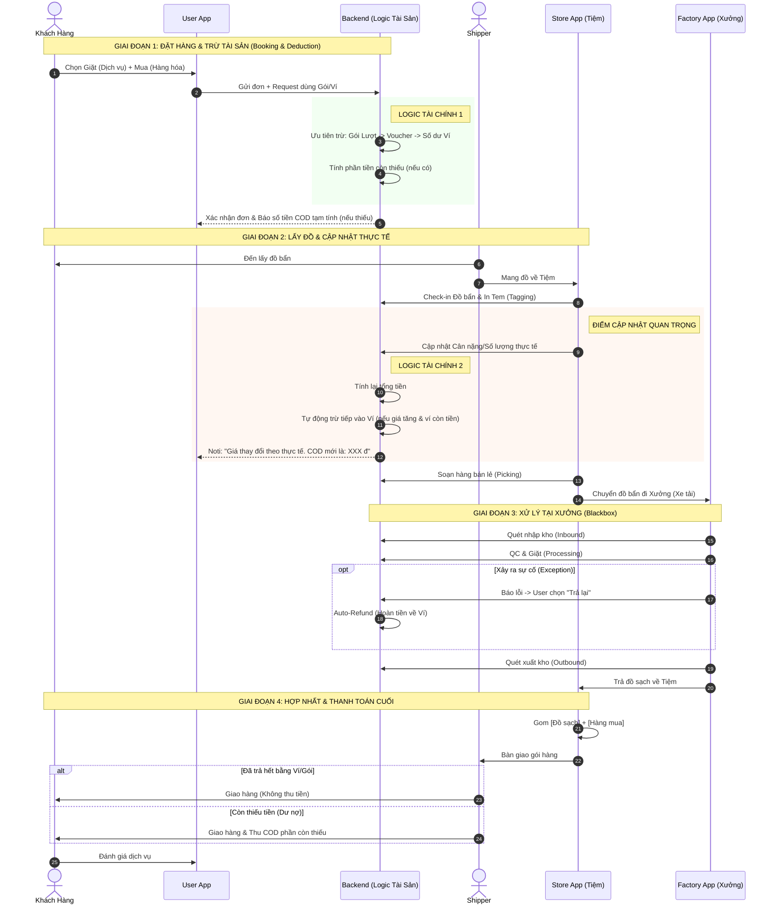

## Low Level Flow
### Luồng 1: Đặt hàng hợp nhất (User Booking Flow)
Việc thêm tính năng **Quản lý Tài sản (Ví/Gói)** sẽ làm thay đổi **cốt lõi** của Luồng 1 (Đặt hàng).

**Thay đổi lớn nhất:** Trước khi "Chốt đơn", hệ thống cần thêm một bước **"Tính toán & Trừ thử" (Simulation/Preview)**. Khách hàng cần nhìn thấy: *"Tổng 100k, trừ gói còn 50k, trừ ví còn 20k, tôi chỉ cần trả 20k thôi"* trước khi bấm nút Đặt hàng.

Dưới đây là **Sequence Diagram Cập nhật** và **Bảng Mã lỗi bổ sung** cho phần tài chính này.

-----

### SEQUENCE DIAGRAM CẬP NHẬT: ĐẶT HÀNG & TRỪ TÀI SẢN (Full Logic)

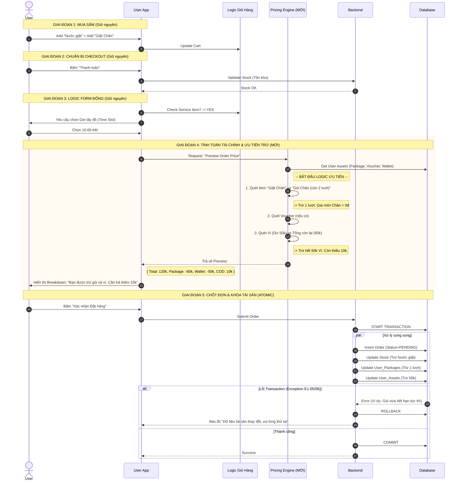

| Mã Lỗi | Tình huống (Scenario) | Xử lý của Hệ thống (System Handling) | Hành động hiển thị (UX/UI) |
| :--- | :--- | :--- | :--- |
| **E1-01** | **Hết hàng phút chót (Inventory Clash)** Khách bỏ Nước giặt vào giỏ, nhưng lúc bấm Checkout thì Tiệm hết hàng (do người khác mua mất). | **Inventory Check:** - Check tồn kho Real-time khi bấm "Thanh toán". - Nếu `stock = 0` $\rightarrow$ Block Checkout. | Hiển thị Popup: *"Sản phẩm 'Nước giặt Omo' tạm hết tại cửa hàng phục vụ bạn. Vui lòng bỏ ra khỏi giỏ hoặc chọn sản phẩm khác."* |
| **E1-02** | **Quá tải dịch vụ (Slot Full)** Khách chọn 10:00 AM, nhưng Shipper full lịch vào giờ đó. | **Capacity Check:** - Check năng lực Shipper/Store. - Ẩn/Khóa các Slot đã đầy. | Slot 10:00 AM bị làm mờ (Disabled), hiện chữ "Full". Gợi ý chọn 11:00 AM. |
| **E1-03** | **Xóa sạch Dịch vụ (Empty Service)** Khách chọn Giặt + Mua $\rightarrow$ Chọn giờ lấy $\rightarrow$ Quay lại xóa món Giặt, chỉ để lại món Mua. | **UI Switch Logic:** - Hệ thống detect trong giỏ không còn `Type=SERVICE`. - Tự động Clear trường "Giờ lấy đồ". | Màn hình Checkout tự động ẩn phần "Chọn giờ lấy đồ", chuyển sang giao diện Giao hàng thương mại bình thường. |
| **E1-04** | **Ngoài vùng phục vụ (Out of Range)** Địa chỉ khách quá xa Tiệm (Store) được chỉ định. | **Distance Check:** - Tính khoảng cách User $\rightarrow$ Store. - Nếu \> `Max_Distance` $\rightarrow$ Block. | Thông báo: *"Rất tiếc, địa chỉ của bạn chưa nằm trong vùng phục vụ của chúng tôi."* |
| **E1-05** | **Tài sản thay đổi phút chót (Asset Race Condition)** Lúc xem Preview thì còn Gói giặt, nhưng 1 giây sau vợ của User dùng mất gói đó ở máy khác. Khi bấm "Đặt hàng" thì gói không đủ. | **Transaction Check:** - Khi Commit, check lại số dư lần cuối. - Nếu `remaining < required` $\rightarrow$ Rollback & Báo lỗi. | Popup: *"Gói dịch vụ hoặc Số dư ví của bạn vừa có thay đổi. Vui lòng tải lại trang thanh toán để cập nhật giá mới."* |
| **E1-06** | **Gói hết hạn đúng lúc đặt (Just Expired)** Gói hết hạn lúc 10:00:00. Khách bấm đặt lúc 10:00:01. | **Time Validation:** - Check `expiry_date` so với `server_time`. - Nếu hết hạn $\rightarrow$ Không trừ gói, tính giá gốc. | Thông báo: *"Rất tiếc, Gói giặt chăn của bạn vừa hết hạn. Đơn hàng sẽ được tính theo giá niêm yết. Bạn có muốn tiếp tục?"* |
| **E1-07** | **Lỗi trừ tiền âm (Negative Balance)** Do lỗi logic nào đó khiến Ví bị trừ quá số dư hiện có. | **Database Constraint:** - Cột `balance` trong DB phải đặt constraint `UNSIGNED` (Không âm) hoặc Trigger chặn. - Backend catch lỗi SQL. | Báo lỗi chung: *"Giao dịch thất bại (Lỗi E1-07). Vui lòng liên hệ CSKH."* |
| **E1-08** | **Không đủ điều kiện Voucher** Voucher giảm 20k cho đơn 100k. Sau khi trừ Gói dịch vụ, tổng tiền đơn hàng tụt xuống còn 50k (dưới chuẩn Voucher). | **Re-validate Voucher:** - Logic: `Total_After_Package` phải \>= `Min_Order_Value`. - Nếu không đủ $\rightarrow$ Gỡ Voucher ra. | Toast message: *"Voucher đã bị gỡ do đơn hàng không đủ giá trị tối thiểu sau khi dùng Gói dịch vụ."* |

- Lưu ý kỹ thuật cho Dev Team:

  - **Database Transaction (Giai đoạn 5):** Đây là phần quan trọng nhất. Việc (Tạo đơn + Trừ kho + Trừ gói + Trừ tiền) phải nằm trong **cùng 1 Transaction**. Nếu 1 trong 4 cái thất bại, cả 3 cái kia phải quay lại từ đầu (Rollback). Tuyệt đối không để tình trạng "Trừ tiền rồi mà Đơn không tạo được".
  - **Concurrency (Đồng thời):** Chú ý xử lý trường hợp 1 tài khoản đăng nhập trên 2 điện thoại cùng đặt đơn 1 lúc để "hack" dùng 2 lần gói dịch vụ. (Giải pháp: Database Row Locking lúc update).

### Luồng 2: Xử lý tại Tiệm (Store Operations)
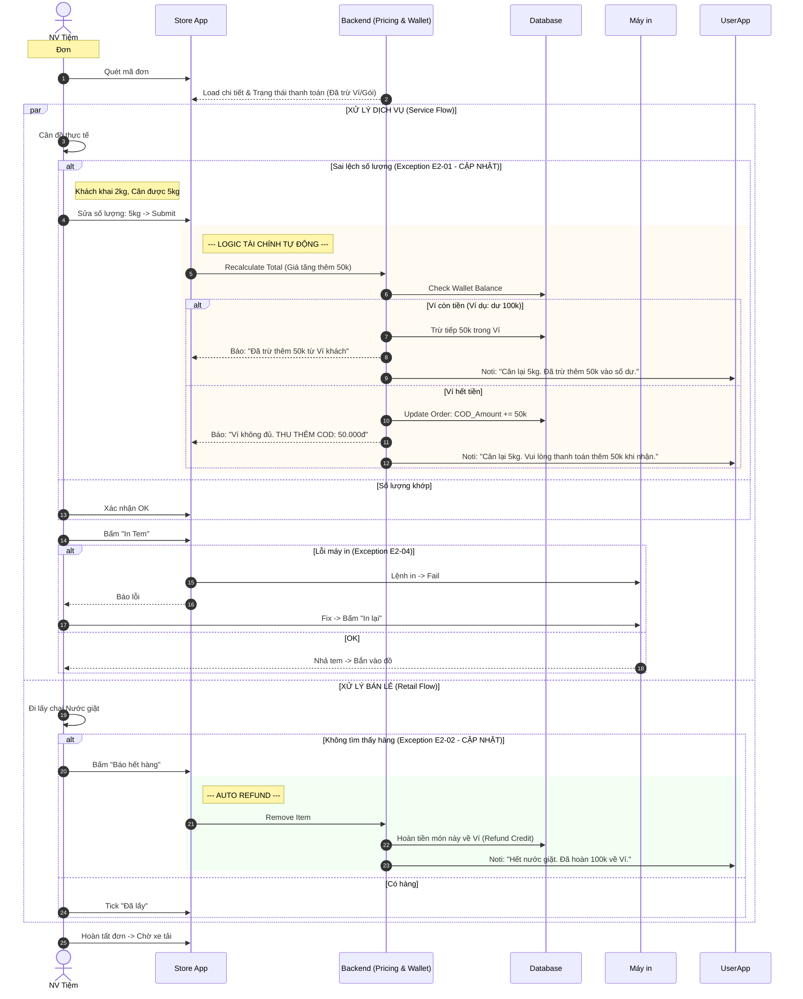

| Mã Lỗi | Tình huống (Scenario) | Xử lý của Hệ thống (System Handling) | Hành động (Store Staff Action) |
| :--- | :--- | :--- | :--- |
| **E2-01** | **Sai lệch số lượng (Giá Tăng)** Khách đặt 2kg (40k), Cân thực tế 5kg (100k). Chênh lệch: +60k. | **Logic "Truy thu" (Charge):** 1. Check số dư Ví. 2. Nếu đủ: Trừ Ví 60k. 3. Nếu thiếu: Cộng 60k vào tiền COD cần thu. 4. Gửi Noti báo rõ nguồn tiền bị trừ. | - Nhập số thực tế. - **Quan trọng:** Nhìn màn hình App xem có hiện dòng *"Cần thu thêm COD"* không để ghi chú cho Shipper. |
| **E2-01B**| **Sai lệch số lượng (Giá Giảm)** Khách đặt 5kg, Cân thực tế 2kg. Chênh lệch: -60k. | **Logic "Hoàn tiền" (Refund):** 1. Tính số tiền thừa. 2. **Cộng ngược vào Ví (Credit Balance)**. 3. Tuyệt đối không hoàn tiền mặt qua Shipper. | Nhập số thực tế $\rightarrow$ Báo khách: *"Tiền thừa đã được hoàn về Ví để dùng lần sau"*. |
| **E2-02** | **Hết hàng (Out of Stock)** Khách đã trả tiền mua Nước giặt (100k), nhưng Tiệm hết hàng. | **Logic "Auto Refund":** 1. Hủy item khỏi đơn. 2. Hoàn 100k vào Ví khách hàng. 3. Gửi Noti xin lỗi. | Bấm "Báo hết hàng" trên App. |
| **E2-03** | **Từ chối nhận đồ (Rejected)** Áo da bị mốc, không nhận giặt. | **Logic "Void Service":** 1. Đổi trạng thái Item `REJECTED`. 2. Hoàn phí dịch vụ món đó về Ví. | Bấm "Từ chối" $\rightarrow$ Chọn lý do $\rightarrow$ Dán tem "TRẢ LẠI". |
| **E2-04** | **Lỗi máy in (Printer Error)** *Mục này lấy từ bản cũ* Bấm in tem nhưng máy in kẹt giấy/hết giấy/mất kết nối. | **Logic "Reprint":** 1. Không sinh mã định danh mới (tránh trùng lặp ID). 2. Cho phép gửi lại lệnh in cho mã cũ. | Kiểm tra giấy/Bluetooth $\rightarrow$ Bấm nút "In lại" (Reprint) trên App. |
| **E2-05** | **Khách hủy khi đang cân (User Cancel)** Vừa nhận tin nhắn báo giá tăng, khách gọi điện đòi hủy luôn đơn hàng đang ở Tiệm. | **Logic "Force Cancel & Refund":** 1. Staff hủy đơn tại Tiệm. 2. Hệ thống hoàn toàn bộ tiền đã thanh toán về Ví. 3. Tính phí phạt (nếu có - tùy chính sách). | Bấm nút "Hủy đơn" trên App Store $\rightarrow$ Trả đồ lại cho Shipper mang về cho khách. |

- Điểm nhấn cho Dev:

  - **Không bao giờ hoàn tiền mặt (No Cash Refund):** Trong quy trình O2O này, nếu có bất kỳ sự cố nào làm giảm giá trị đơn hàng (cân nhẹ hơn, hết hàng, từ chối giặt), hệ thống mặc định **Hoàn về Ví (Credit)**. Điều này giúp đơn giản hóa quy trình cho Shipper (không phải móc túi trả lại tiền) và giữ chân khách hàng.

### Luồng 3: Xưởng vận hành & Truy vấn (Factory In/Out/Query)
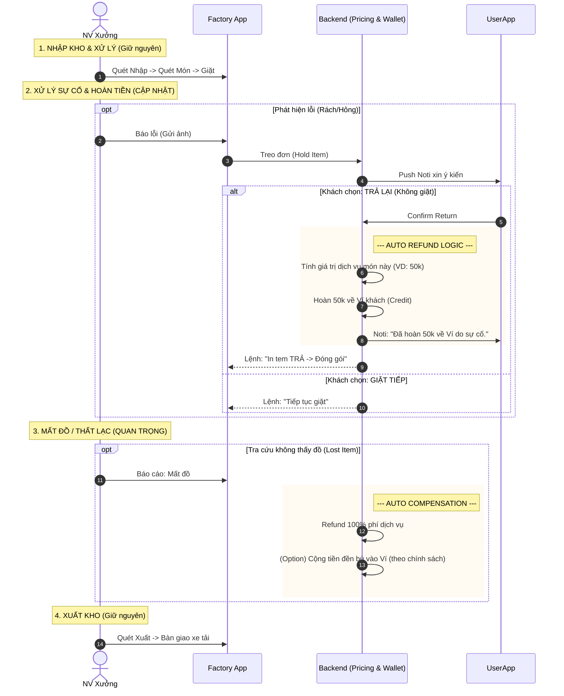

| Mã Lỗi | Tình huống (Scenario) | Xử lý của Hệ thống (System Handling) | Hành động (Factory Staff Action) |
| :--- | :--- | :--- | :--- |
| E3-01  | **Thiếu bao (Missing Bag on Manifest)**  App báo xe tải có 10 bao, đếm thực tế chỉ có 9.                    | Logic "Dispute Inbound": - Cho phép xác nhận số lượng thực tế (9/10). - Tạo Ticket cảnh báo "Mất bao" gửi về Admin/Tiệm.                                | Staff nhập số thực tế: "9" → Hệ thống cảnh báo đỏ 🔴 → Bấm "Xác nhận thiếu" để tiếp tục.            |
| E3-02  | **Dư bao (Ghost Bag)**  App báo 10 bao, đếm ra 11 bao (Tiệm gửi thừa nhưng quên quét).                      | Logic "Force Inbound": - Cho phép quét mã bao thừa. - Hệ thống tự động add bao đó vào Manifest chuyến xe.                                               | Staff quét bao thừa → App báo: "Bao này chưa có trong chuyến, bạn muốn thêm vào?" → Chọn "Yes".    |
| E3-03  | **Tem không đọc được (Unreadable Tag)**  Mã vạch bị mờ do nước/hóa chất, máy quét không nhận.               | Logic "Manual Lookup": - Cho phép nhập mã số (Human readable ID) in dưới mã vạch. - Hoặc: Nếu mất cả số → Quy trình tìm đồ thất lạc (nhập đặc điểm áo). | Staff chọn "Nhập mã thủ công" (Manual Entry) → Gõ ID (ví dụ: 123-01).                              |
| E3-04  | **Bỏ nhầm sọt (Wrong Bin Sorting)**  Đồ của Tiệm A, nhưng nhân viên ném nhầm vào sọt Tiệm B khi xuất xưởng. | Logic "Sorting Validation": - Nếu quét Item xong, quét tiếp Sọt (Bin ID). - Nếu Bin ID không khớp với Item Destination → Báo lỗi Âm thanh lớn.          | Staff quét Áo → Quét Sọt Tiệm B → App kêu "TÍT TÍT TÍT" (Sai rồi) → Staff phải bỏ sang sọt Tiệm A. |
| **E3-05** | **Khách yêu cầu Trả lại (Customer Return)** Sau khi xem ảnh lỗi, khách không đồng ý giặt. | **Logic "Void & Refund":** 1. Đổi trạng thái `RETURN_AS_IS`. 2. **Hoàn tiền dịch vụ về Ví (Credit)**. 3. Gửi Noti báo hoàn tiền. | Nhận lệnh trên App: "In tem TRẢ LẠI" $\rightarrow$ Dán tem đỏ $\rightarrow$ Để riêng. |
| **E3-06** | **Làm mất đồ (Lost Item)** Quét nhập rồi nhưng tìm mãi không thấy để xuất. Xác nhận mất tại Xưởng. | **Logic "Compensate":** 1. Đổi trạng thái `LOST`. 2. **Hoàn tiền + Đền bù vào Ví**. 3. Trừ lương nhân viên/Xưởng (Tính sau ở module HR). | Bấm nút "Báo mất" (Report Lost) trên màn hình Tra cứu. |

### Luồng 4: Xử lý sự cố (Exception Handling)
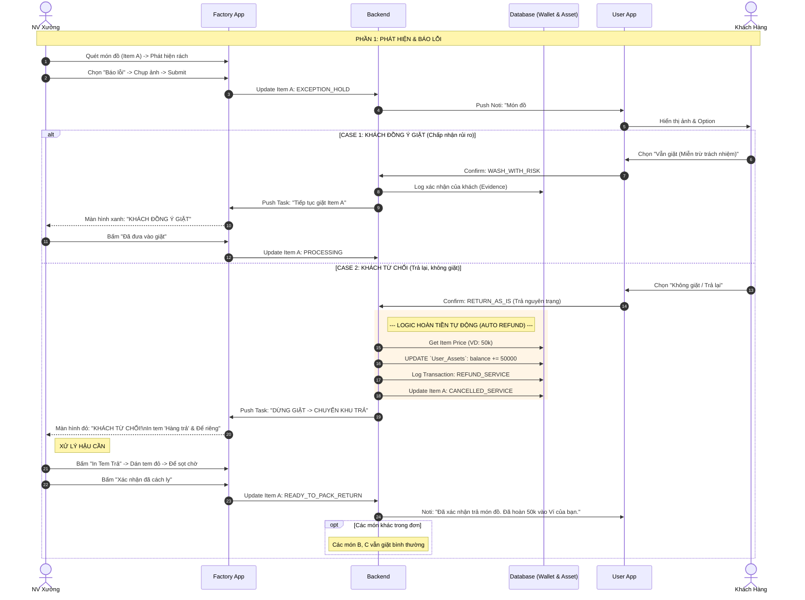

| Mã Lỗi | Tình huống (Scenario) | Xử lý của Hệ thống (System Handling) | Hành động / Hiển thị (Action/UI) |
| :--- | :--- | :--- | :--- |
| **E4-01** | **Khách không phản hồi (Timeout)** Quá 24h khách không xác nhận. | **Logic "Auto-Decision & Refund":** 1. Chuyển trạng thái `RETURN_AS_IS`. 2. **Tự động hoàn phí dịch vụ về Ví (Credit)**. 3. Gửi thông báo kết quả cho khách. | **App Khách:** Thông báo *"Đã quá hạn xác nhận. Hệ thống tự động chuyển sang chế độ TRẢ LẠI và đã hoàn tiền về Ví."* **App Xưởng:** Hiện lệnh *"Hết hạn chờ → In tem TRẢ"* |
| **E4-02** | **Báo lỗi nhầm (Wrong Report)** Nhân viên chụp nhầm ảnh/chọn nhầm lỗi. | **Logic "Recall Report":** - Cho phép "Thu hồi báo cáo" nếu khách chưa phản hồi. - Nếu khách đã phản hồi/đã hoàn tiền $\rightarrow$ Phải gọi Admin để Rollback giao dịch Ví. | **App Xưởng:** Nút "Hủy báo cáo" (Undo) khả dụng trong 5 phút đầu. |
| **E4-03** | **Vỡ điều kiện Voucher (Voucher Violation)** Trả lại món làm đơn hàng tụt dưới mức tối thiểu của Voucher. | **Logic "Re-validate & Partial Refund":** 1. Tính lại giá trị đơn không có món lỗi. 2. Nếu mất Voucher $\rightarrow$ Số tiền hoàn về Ví = (Giá món lỗi) - (Giá trị Voucher bị mất). 3. Cảnh báo khách trước. | **App Khách:** Popup *"Nếu trả lại món này, Voucher 50k sẽ bị hủy. Số tiền thực hoàn về Ví là: 10k. Bạn đồng ý không?"* |
| **E4-04** | **Khách không dùng App (Offline Confirmation)** Khách gọi điện xác nhận. | **Logic "Admin Override":** - Admin thay mặt khách chọn phương án. - Nếu chọn Trả lại $\rightarrow$ Hệ thống vẫn tự động hoàn tiền về Ví như bình thường. | **Web Admin:** Bấm nút "Force Accept/Return" trên trang chi tiết đơn. |
| **E4-05** | **Xử lý sai lệnh (Operation Conflict)** Khách chọn TRẢ, Xưởng vẫn GIẶT. | **Logic "Outbound Alert":** - Khi xuất kho, check trạng thái. - Nếu thấy đồ Sạch mà trạng thái là `RETURN` $\rightarrow$ Cảnh báo & Không trừ tiền lại (coi như giặt khuyến mãi cho khách để xin lỗi). | **App Xưởng:** Cảnh báo đỏ *"Món này khách yêu cầu TRẢ. Hãy kiểm tra lại\!"* |
| **E4-06** | **Mất đồ tại xưởng (Lost Item)** Tìm mãi không thấy đồ. | **Logic "Compensation":** 1. Xác nhận Mất. 2. **Hoàn 100% phí dịch vụ về Ví**. 3. **Cộng thêm tiền đền bù** (theo cấu hình Admin) vào Ví. | **App Xưởng:** Chức năng "Báo mất" (Report Lost). **App Khách:** Noti *"Rất xin lỗi, chúng tôi đã làm thất lạc đồ. Đã đền bù xxx tiền vào Ví của bạn."* |

### Admin flows

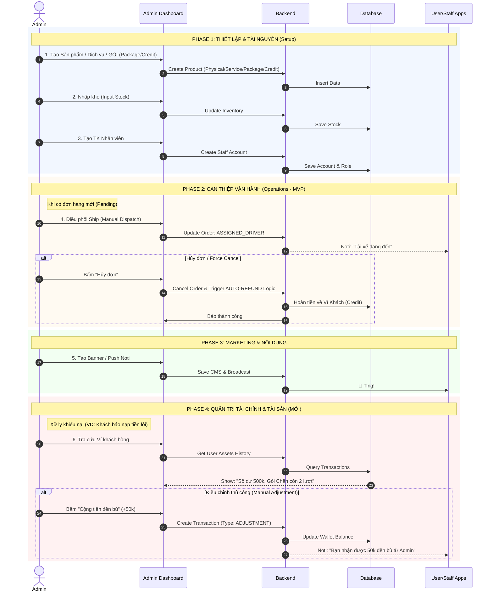

| Mã Lỗi | Tình huống | Xử lý của Hệ thống | Hành động hiển thị (Admin UI) |
| :--- | :--- | :--- | :--- |
| **A-01** | **Trùng SKU** Nhập mã SKU đã tồn tại. | Check Unique Constraint. | **Báo đỏ:** "Mã SKU 'NUOC-GIAT-01' đã tồn tại." |
| **A-02** | **Xung đột xóa (Active Constraint)** Xóa món đang có đơn chạy. | Query Active Orders. | **Alert:** "Không thể ẩn. Còn 5 đơn hàng đang xử lý chứa sản phẩm này." |
| **A-03** | **Lỗi định dạng ảnh** Upload ảnh sai quy định. | Validate File. | **Báo:** "Ảnh phải định dạng JPG/PNG \< 2MB." |
| **A-04** | **Điều chỉnh số dư Âm (Invalid Adjustment)** Admin trừ tiền phạt quá tay khiến ví khách bị âm. | **Balance Check:** - Check `Current Balance` + `Adjust Amount`. - Nếu \< 0 $\rightarrow$ Block. | **Báo lỗi:** "Số dư hiện tại của khách là 20k. Không thể trừ 50k. Vui lòng kiểm tra lại." |
| **A-05** | **Gói cước không hợp lệ (Invalid Package Config)** Tạo gói "3 lần giặt" nhưng quên chọn Dịch vụ áp dụng. | **Config Validation:** - Bắt buộc chọn `Service_ID` khi tạo gói `COUNT_BASED`. | **Highlight:** "Vui lòng chọn Dịch vụ áp dụng cho gói này (VD: Giặt Chăn)." |
| **A-06** | **Hủy đơn đã hoàn tất (Completed Order Cancel)** Cố gắng hủy một đơn đã giao thành công và đã đối soát. | **Status Check:** - Nếu `Status = COMPLETED` $\rightarrow$ Block Hủy. | **Alert:** "Đơn hàng đã hoàn tất và ghi nhận doanh thu. Không thể hủy. Hãy dùng chức năng 'Hoàn tiền' nếu cần." |

### Asset management flows

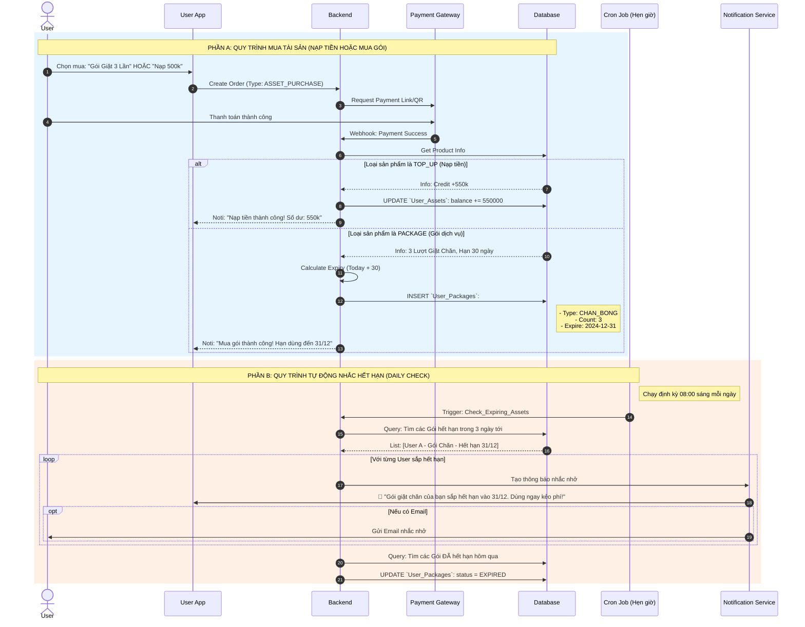

| Mã Lỗi   | Tình huống                                                                                                                                               | Xử lý                                                                                                                                                                    |
| :------- | :------------------------------------------------------------------------------------------------------------------------------------------------------- | :----------------------------------------------------------------------------------------------------------------------------------------------------------------------- |
| Asset-01 | **Mua trùng gói (Duplicate)**  Khách đang còn gói Chăn (hạn 5 ngày), mua thêm gói Chăn mới (hạn 30 ngày).                                          | **Logic cộng dồn (Stacking):** Tạo một dòng mới (New Record) trong DB. Khi Checkout, hệ thống tự động trừ vào gói có hạn dùng gần nhất trước (FIFO theo Expiry Date). |
| Asset-02 | **Quên dùng (Expired)**  Khách quên dùng, gói bị hết hạn. Khách gọi điện xin gia hạn.                                                              | **Admin Tool:** Cho phép Admin vào sửa expiry_date để gia hạn thêm vài ngày cho khách (giữ chân khách hàng).                                                          |
| Asset-03 | **Cron Job chết (System Fail)**  Server bị lỗi, Cron job không chạy, khách không nhận được thông báo nhắc nhở -> Khách kiện vì không biết hết hạn. | **Fail-safe:** Ghi log mỗi lần Cron chạy thành công. Nếu quá 24h không thấy log -> Bắn cảnh báo cho Admin/Dev để kiểm tra Server.                                     |

### Report flows

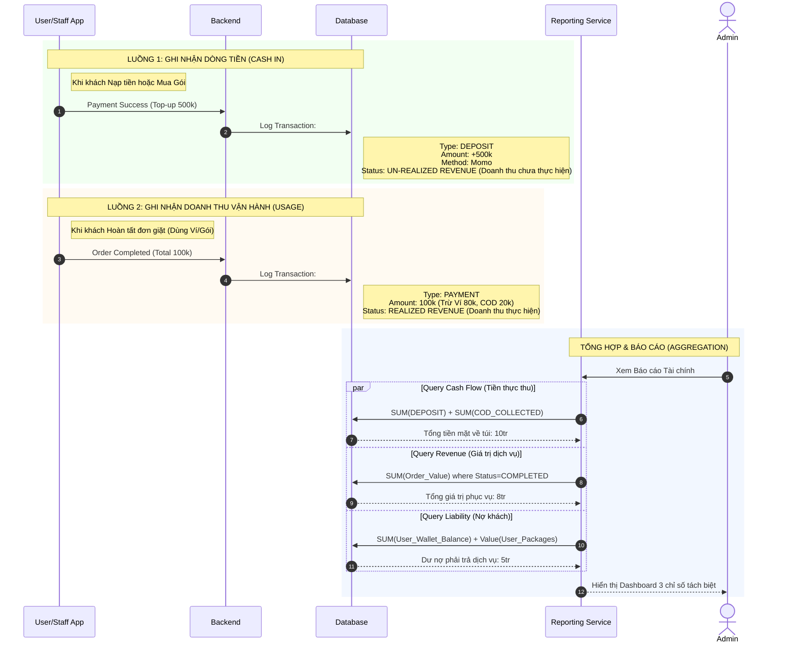

| Mã Lỗi | Tình huống (Scenario) | Nguyên nhân | Xử lý & Hiển thị (Solution) |
| :--- | :--- | :--- | :--- |
| **R-01** | **Lệch tiền COD (Cash Mismatch)** Shipper nộp thiếu tiền thu hộ. | Shipper làm mất hoặc gian lận. | **Manual Adjustment:** Kế toán tạo phiếu thu ghi nhận số thực nộp. Phần thiếu ghi vào "Công nợ Shipper" để trừ lương. |
| **R-02** | **Đơn hàng treo (Pending Orders)** Doanh thu ước tính cao nhưng chưa hoàn tất. | Đơn bị kẹt ở trạng thái `PROCESSING`. | **Cảnh báo:** List ra các đơn quá hạn 48h chưa xong để Vận hành xử lý dứt điểm (Hoàn thành hoặc Hủy). |
| **R-03** | **Âm kho ảo / Âm ví ảo** Báo cáo ghi nhận số dư ví khách hàng \< 0. | Lỗi logic khi trừ tiền phạt hoặc truy thu COD. | **Highlight Đỏ:** Cảnh báo Admin kiểm tra ngay các User ID bị âm tiền để fix bug hoặc truy thu. |
| **R-04** | **Doanh thu ảo (Double Counting)** Tổng doanh thu cao bất thường (Cộng cả tiền nạp + tiền tiêu). | Code báo cáo cộng gộp cả `DEPOSIT` và `PAYMENT`. | **Tách báo cáo:** 1. **Báo cáo Dòng tiền (Cashflow):** Chỉ tính Tiền nạp + COD. 2. **Báo cáo Kinh doanh (P\&L):** Chỉ tính Giá trị đơn hàng hoàn tất. |
| **R-05** | **Lệch số dư tổng (Liability Mismatch)** Tổng tiền nạp vào (100 đồng) - Tổng tiền đã tiêu (30 đồng) \!= Tổng số dư hiện tại của tất cả user (65 đồng?? Lệch 5 đồng). | Có giao dịch sửa số dư thủ công (Admin) hoặc lỗi hoàn tiền không ghi log. | **Audit Log:** Quét lại toàn bộ bảng `Wallet_Transactions` để tìm ra giao dịch nào làm lệch số dư tổng. |
| **R-06** | **Hoàn tiền ngoại lệ (Offline Refund)** Khách nạp 1tr, muốn rút lại tiền mặt 500k (Cash out) vì không dùng nữa. | Hệ thống MVP không hỗ trợ rút tiền (Withdraw). | **Thao tác thủ công:** 1. Admin trừ 500k trong ví User (Type: `ADMIN_DEDUCT`). 2. Kế toán chi tiền mặt/CK ngoài luồng. 3. Note rõ lý do trong log. |

- Bạn cần yêu cầu Dev hiển thị 3 con số này to rõ trên màn hình Admin, không được gộp chung:

  1. **GMV (Gross Merchandise Value - Tổng giá trị giao dịch):**
      * Tổng giá trị các đơn hàng đã hoàn thành (Bất kể trả bằng Ví hay Tiền mặt).
      * *Ý nghĩa:* Cho biết quy mô vận hành, độ đắt khách của Tiệm.
  2. **Cash Collection (Thực thu tiền mặt):**
      * \= (Tổng tiền khách Nạp thẻ/Mua gói) + (Tổng tiền COD thu được).
      * *Ý nghĩa:* Tiền tươi thóc thật về túi doanh nghiệp hôm nay.
  3. **Outstanding Liability (Dư nợ khách hàng - Quan trọng cho chủ tiệm):**
      * \= Tổng số dư Ví của tất cả khách + Giá trị quy đổi các Gói chưa dùng.
      * *Ý nghĩa:* Đây là khoản tiền khách đã đưa trước nhưng mình chưa phục vụ. **Không được tiêu hết số tiền này**, phải giữ lại để duy trì hoạt động phục vụ khách sau này.

## Status changing
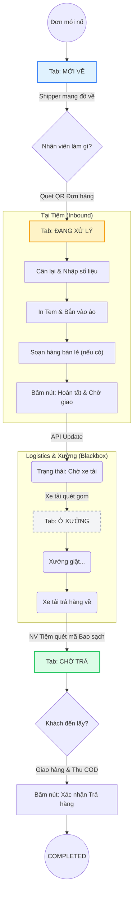

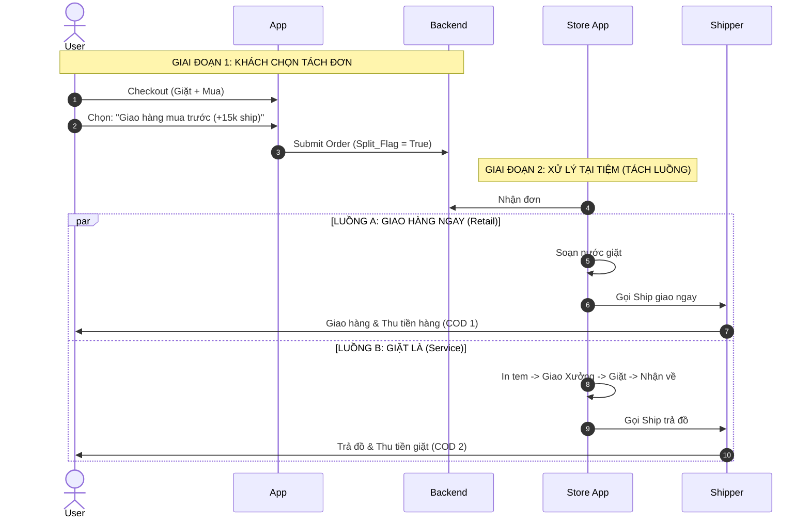
## Notifications
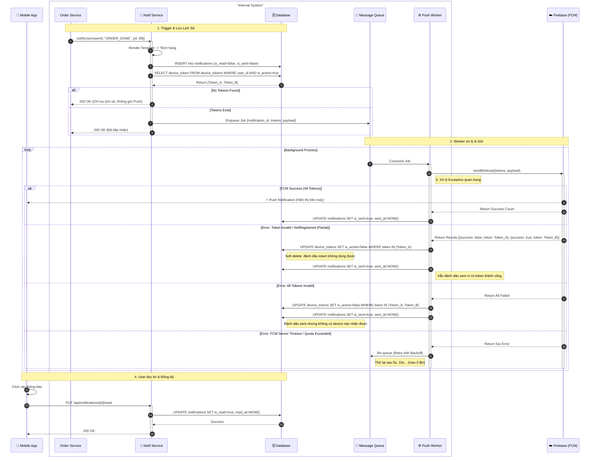

**Lưu ý kỹ thuật:**

1. **Tên bảng đã sửa:**
   - `notification_history` → `notifications` (theo model thực tế)
   - `user_devices` → `device_tokens` (theo model thực tế)
   - `fcm_token` → `device_token` (theo column thực tế)

2. **Xử lý token lỗi:**
   - Không DELETE token, mà set `is_active=false` (soft delete) để giữ lịch sử
   - Xử lý trường hợp **partial success** (một số token thành công, một số lỗi)
   - Xử lý trường hợp **all tokens invalid** (tất cả đều lỗi)

3. **Tracking trạng thái:**
   - Cập nhật `is_sent=true` và `sent_at` sau khi gửi (thành công hoặc thất bại)
   - Cập nhật `read_at` khi user đọc notification

4. **Cải thiện có thể thêm:**
   - Check `notification_preferences.push_enabled` trước khi gửi
   - Check `quiet_hours` (không gửi trong giờ nghỉ, trừ URGENT)
   - Retry limit (max 3 lần) để tránh loop vô hạn
   - Logging/metrics cho monitoring