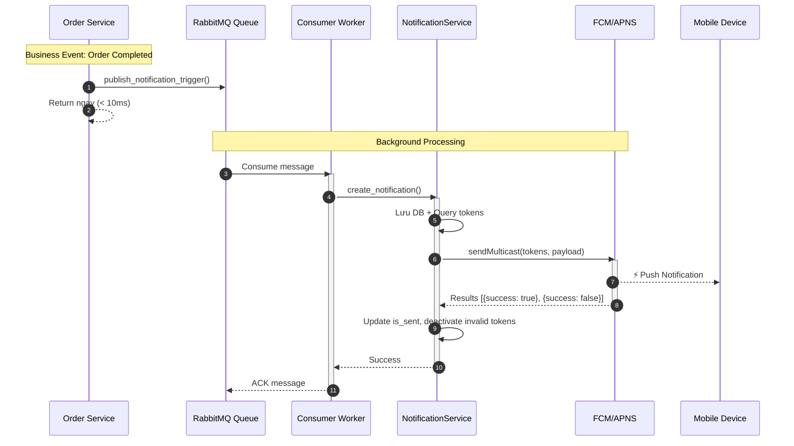

# Notification System - Complete Documentation

## Mục lục

1. [Tổng quan](#tổng-quan)
2. [Kiến trúc](#kiến-trúc)
3. [Tech Stack](#tech-stack)
4. [Database Model](#database-model)
5. [Flow Chi Tiết](#flow-chi-tiết)
6. [Setup & Installation](#setup--installation)
7. [Usage](#usage)
8. [API Endpoints](#api-endpoints)
9. [FCM/APNS Explained](#fcmapns-explained)
10. [Troubleshooting](#troubleshooting)

---

## Tổng quan

Hệ thống Notifications sử dụng **Queue-based Architecture** với:
- **Database Storage** (Persistent) - Lưu tất cả notifications
- **Real-time Push** (FCM/APNS) - Gửi push đến mobile devices
- **Polling API** (Fallback) - Client query khi mở app
- **Event-driven** - Trigger notifications từ business events qua Queue

**Đặc điểm:**
- ✅ **Non-blocking**: API response nhanh (< 100ms)
- ✅ **Scalable**: Scale workers độc lập
- ✅ **Reliable**: Queue đảm bảo message không mất, retry tự động
- ✅ **Decoupled**: Business services không phụ thuộc notification logic

---

## Kiến trúc

### Flow Tổng Quan

```
┌─────────────────────────────────────────────────────────────┐
│                    BUSINESS SERVICES                         │
│  ┌──────────────┐  ┌──────────────┐  ┌──────────────┐    │
│  │Order Service │  │Payment Service│  │Wallet Service│    │
│  └──────┬───────┘  └──────┬───────┘  └──────┬───────┘    │
│         │                  │                  │              │
│         │  Publish Message │                  │              │
│         ▼                  ▼                  ▼              │
│  ┌──────────────────────────────────────────────────────┐  │
│  │     publish_notification_trigger()                  │  │
│  │     publish_device_token_update()                   │  │
│  │     (Queue Publisher Utility)                       │  │
│  └───────────────────────────┬────────────────────────┘  │
└───────────────────────────────┼────────────────────────────┘
                                │
                                │ Message vào Queue
                                ▼
┌─────────────────────────────────────────────────────────────┐
│                    RABBITMQ QUEUE                           │
│                                                             │
│  Queue: notification_triggers                                │
│  Queue: device_token_updates                                │
│  Exchange: notifications                                    │
└───────────────────────────┬─────────────────────────────────┘
                            │
                            │ Consume Message
                            ▼
┌─────────────────────────────────────────────────────────────┐
│              CONSUMER (Celery Worker)                        │
│                                                             │
│  ┌──────────────────────────────────────────────────────┐  │
│  │  process_notification_trigger()                      │  │
│  │  process_device_token_update()                       │  │
│  │  - Nhận message từ queue                            │  │
│  │  - Gọi NotificationService / DeviceTokenService     │  │
│  └───────────────────────────┬──────────────────────────┘  │
└───────────────────────────────┼────────────────────────────┘
                                │
                                │ Call Service
                                ▼
┌─────────────────────────────────────────────────────────────┐
│              NOTIFICATION SERVICE                            │
│              DEVICE TOKEN SERVICE                            │
│                                                             │
│  ┌──────────────────────────────────────────────────────┐  │
│  │  create_notification()                               │  │
│  │  - Lưu vào DB                                        │  │
│  │  - Query device tokens                               │  │
│  │  - Gửi push qua FCM                                  │  │
│  └───────────────────────────┬──────────────────────────┘  │
└───────────────────────────────┼────────────────────────────┘
                                │
                                │ Send Push
                                ▼
┌─────────────────────────────────────────────────────────────┐
│                    FCM / APNS                                │
│                    (Google / Apple)                          │
└───────────────────────────┬─────────────────────────────────┘
                            │
                            │ Deliver
                            ▼
┌─────────────────────────────────────────────────────────────┐
│                    MOBILE DEVICES                            │
└─────────────────────────────────────────────────────────────┘
```

### Internal vs External

**Notification Service có 2 phần:**

1. **Internal Service** (`NotificationService`, `DeviceTokenService`)
   - Code-to-code, không có HTTP endpoint
   - Gọi từ Consumer Worker
   - Location: `app/services/`

2. **External API** (`NotificationRouter`)
   - HTTP endpoints cho mobile app
   - Sử dụng Internal Service bên trong
   - Location: `app/routers/`

3. **Worker** (`NotificationWorker`)
   - Background process, consume từ queue
   - Location: `app/workers/`

---

## Tech Stack

### Backend Framework & Core

**✅ Đã có sẵn:**
- FastAPI (0.109.0) - Web framework async
- SQLAlchemy 2.0 (2.0.25) - ORM async
- PostgreSQL 16 - Database
- Alembic (1.13.1) - Migration

**📦 Cần thêm:**
```txt
celery==5.3.4              # Background task queue
kombu==5.3.4               # RabbitMQ client
amqp==5.2.0                # AMQP protocol
firebase-admin==6.4.0      # FCM client (hoặc pyfcm)
httpx==0.26.0              # HTTP client
structlog==24.1.0          # Structured logging
```

### Message Queue

**Celery + RabbitMQ** (Recommended)
- ✅ Mature, stable, nhiều features
- ✅ Retry, scheduling, monitoring tools
- ✅ Hỗ trợ nhiều workers
- ✅ Management UI (RabbitMQ)

### Push Notification

**Firebase Cloud Messaging (FCM)**
- ✅ Free, unlimited
- ✅ Hỗ trợ Android và iOS
- ✅ Reliable delivery

### Mobile App

**Flutter** (Recommended)
```yaml
dependencies:
  firebase_core: ^2.24.0
  firebase_messaging: ^14.7.0
  flutter_local_notifications: ^16.3.0
```

---

## Database Model

### Notifications Table

```sql
CREATE TABLE notifications (
    id BIGSERIAL PRIMARY KEY,
    user_id INTEGER NOT NULL,
    user_type VARCHAR(20) NOT NULL,  -- 'CUSTOMER', 'STAFF', 'ADMIN'
    
    -- Content
    type VARCHAR(50) NOT NULL,  -- 'ORDER_COMPLETED', 'PAYMENT_SUCCESS', etc.
    title VARCHAR(255) NOT NULL,
    body TEXT NOT NULL,
    data JSONB,  -- Additional data
    
    -- Status
    is_read BOOLEAN DEFAULT FALSE,
    read_at TIMESTAMP,
    is_sent BOOLEAN DEFAULT FALSE,
    sent_at TIMESTAMP,
    
    -- Priority & Expiry
    priority VARCHAR(20) DEFAULT 'NORMAL',  -- 'LOW', 'NORMAL', 'HIGH', 'URGENT'
    expires_at TIMESTAMP,
    
    -- Metadata
    action_url VARCHAR(500),  -- Deeplink
    image_url VARCHAR(500),
    
    -- Foreign Keys
    order_id BIGINT,
    incident_id INTEGER,
    transaction_id BIGINT,
    package_id INTEGER,
    
    created_at TIMESTAMP DEFAULT NOW(),
    updated_at TIMESTAMP DEFAULT NOW()
);
```

### Device Tokens Table

```sql
CREATE TABLE device_tokens (
    id SERIAL PRIMARY KEY,
    user_id INTEGER NOT NULL,
    user_type VARCHAR(20) NOT NULL,
    
    device_token VARCHAR(500) NOT NULL UNIQUE,  -- FCM/APNS token
    platform VARCHAR(20) NOT NULL,  -- 'IOS', 'ANDROID', 'WEB'
    app_version VARCHAR(20),
    device_info JSONB,  -- {model, os_version, etc.}
    
    is_active BOOLEAN DEFAULT TRUE,
    last_used_at TIMESTAMP DEFAULT NOW(),
    created_at TIMESTAMP DEFAULT NOW()
);
```

### Notification Preferences Table

```sql
CREATE TABLE notification_preferences (
    id SERIAL PRIMARY KEY,
    user_id INTEGER NOT NULL,
    user_type VARCHAR(20) NOT NULL,
    
    push_enabled BOOLEAN DEFAULT TRUE,
    email_enabled BOOLEAN DEFAULT FALSE,
    sms_enabled BOOLEAN DEFAULT FALSE,
    
    type_settings JSONB DEFAULT '{}',  -- {"ORDER_STATUS": true, ...}
    
    quiet_hours_start TIME,  -- 22:00
    quiet_hours_end TIME,    -- 08:00
    
    UNIQUE(user_id, user_type)
);
```

---

## Flow Chi Tiết

### 1. Notification Trigger Flow

**Business Service → Queue → Consumer → NotificationService → FCM**

```python
# services/order_service.py
from app.utils.queue_publisher import publish_notification_trigger

class OrderService:
    async def complete_order(self, order_id: int):
        # Business logic
        order.status = "COMPLETED"
        await db.commit()
        
        # Chỉ publish message vào queue (title/body sẽ được render từ template)
        from app.config.notification_templates import NotificationType
        
        publish_notification_trigger(
            user_id=order.customer_id,
            user_type="CUSTOMER",
            notification_type=NotificationType.ORDER_COMPLETED,  # Hoặc "ORDER_COMPLETED"
            data={
                "order_code": order.order_code,
                "order_id": order.id,
            },
            order_id=order.id,
        )
        # Template sẽ tự động render: "Đơn hàng #DH-001" / "đã hoàn thành"
        # ↑ Non-blocking, return ngay
```

**Consumer xử lý:**
```python
# workers/notification_worker.py
@celery_app.task
def process_notification_trigger(message: dict):
    # Nhận message từ queue
    # Gọi NotificationService.create_notification()
    asyncio.run(_process_async(message))
```

**NotificationService:**
```python
# services/notification_service.py
async def create_notification(notification_type, data, ...):
    # 1. Render template để lấy title, body, action_url
    title, body, action_url = render_notification(notification_type, data)
    
    # 2. Lưu vào DB
    notification = Notification(
        type=notification_type,
        title=title,  # Từ template
        body=body,    # Từ template
        ...
    )
    await session.commit()
    
    # 3. Query device tokens
    tokens = await get_device_tokens(...)
    
    # 4. Gửi push ngay (sync trong async)
    await _send_push_notification(...)
```

### 2. Device Token Update Flow

**Mobile App → API → Queue → Consumer → DeviceTokenService → DB**

```python
# routers/notification_router.py
@router.post("/device-token")
async def register_device_token(request):
    # Chỉ publish message vào queue
    publish_device_token_update(
        user_id=user_id,
        device_token=request.token,
        platform=request.platform,
        action="register",
    )
    return {"success": True, "message": "queued"}
```

**Consumer xử lý:**
```python
# workers/notification_worker.py
@celery_app.task
def process_device_token_update(message: dict):
    # Nhận message từ queue
    # Gọi DeviceTokenService.register_device_token()
```

### 3. Sequence Diagram



---

## Setup & Installation

### 1. Install Dependencies

```bash
pip install celery kombu amqp firebase-admin httpx structlog
```

### 2. Setup RabbitMQ

```bash
# Docker
docker run -d -p 5672:5672 -p 15672:15672 \
  -e RABBITMQ_DEFAULT_USER=guest \
  -e RABBITMQ_DEFAULT_PASS=guest \
  rabbitmq:3-management

# Management UI: http://localhost:15672 (guest/guest)
```

Hoặc dùng `docker-compose.rabbitmq.yml`:
```bash
docker-compose -f docker-compose.rabbitmq.yml up -d
```

### 3. Setup Firebase

1. Tạo Firebase project tại https://console.firebase.google.com
2. Enable Cloud Messaging API
3. Lấy **Server Key** từ Project Settings → Cloud Messaging
4. Set environment variable:

```bash
export FCM_SERVER_KEY="your_fcm_server_key_here"
```

Hoặc tạo file `.env`:
```env
FCM_SERVER_KEY=your_fcm_server_key_here
RABBITMQ_HOST=localhost
RABBITMQ_PORT=5672
RABBITMQ_USER=guest
RABBITMQ_PASSWORD=guest
RABBITMQ_VHOST=/
```

### 4. Run Services

```bash
# Terminal 1: Run API server
uvicorn main:app --reload

# Terminal 2: Run Celery worker (consumer)
celery -A app.celery_app worker --loglevel=info --queues=notification_triggers,device_token_updates

# Hoặc dùng script
python run_worker.py
```

---

## Usage

### 1. Trigger Notification (từ Business Service)

```python
from app.utils.queue_publisher import publish_notification_trigger
from app.config.notification_templates import NotificationType

# Order Service
async def complete_order(order_id: int):
    order.status = "COMPLETED"
    await db.commit()
    
    # Chỉ publish message vào queue (title/body sẽ được render từ template)
    publish_notification_trigger(
        user_id=order.customer_id,
        user_type="CUSTOMER",
        notification_type=NotificationType.ORDER_COMPLETED,  # Hoặc "ORDER_COMPLETED"
        data={
            "order_code": order.order_code,
            "order_id": order.id,
        },
        order_id=order.id,
    )
    # Template sẽ render: "Đơn hàng #DH-001" / "đã hoàn thành"
```

### 2. Register Device Token (từ Mobile App)

```dart
// Flutter App
String? token = await FirebaseMessaging.instance.getToken();

await http.post(
  'https://api.laundry.com/v1/notifications/device-token',
  headers: {'Authorization': 'Bearer $userToken'},
  body: jsonEncode({
    'token': token,
    'platform': Platform.isIOS ? 'IOS' : 'ANDROID',
    'app_version': '1.0.0',
  }),
);
```

### 3. Notification Types

| Type | Trigger Event | Example |
|------|--------------|---------|
| `ORDER_CREATED` | Order placed | "Đơn hàng #DH-001 đã được tạo" |
| `ORDER_CONFIRMED` | Store confirms | "Đơn hàng #DH-001 đã được xác nhận" |
| `ORDER_COMPLETED` | Order delivered | "Đơn hàng #DH-001 đã hoàn thành" |
| `ORDER_WEIGHT_UPDATED` | Store updates weight | "Cân lại: 5kg. Đã trừ thêm 60k vào ví" |
| `PAYMENT_SUCCESS` | Payment completed | "Thanh toán thành công 500k" |
| `WALLET_REFUND` | Refund processed | "Đã hoàn 50k vào ví do sự cố" |
| `PACKAGE_EXPIRY_WARNING` | Cron job | "Gói giặt chăn còn 7 ngày hết hạn" |

---

## API Endpoints

### Get Notifications

```bash
GET /v1/notifications?limit=50&offset=0&unread_only=false

Response:
{
  "notifications": [...],
  "total": 10,
  "unread_count": 3
}
```

### Mark as Read

```bash
PUT /v1/notifications/{id}/read

Response:
{
  "success": true,
  "notification_id": 123
}
```

### Register Device Token

```bash
POST /v1/notifications/device-token
Body: {
    "token": "fcm_token_abc123...",
    "platform": "ANDROID",
    "app_version": "1.0.0"
}

Response:
{
  "success": true,
  "message": "Device token registration queued"
}
```

### Unregister Device Token

```bash
DELETE /v1/notifications/device-token/{token}

Response:
{
  "success": true,
  "message": "Device token unregistration queued"
}
```

---

## FCM/APNS Explained

### Tại sao KHÔNG dùng WebSocket cho Mobile?

**❌ WebSocket cho Mobile Apps:**
- App phải luôn mở và kết nối
- Khi app đóng → Mất kết nối → Không nhận được notification
- Tốn pin vì phải maintain connection
- Không reliable khi network yếu

**✅ FCM/APNS:**
- Hoạt động ngay cả khi app đóng
- Tiết kiệm pin (OS quản lý connection)
- Reliable (Google/Apple đảm bảo delivery)
- Free (FCM miễn phí)

### Flow: Backend → FCM → Device

```
Backend → FCM API → Google/Apple Servers → Device OS → App
```

**Backend gọi FCM:**
```python
# utils/fcm_client.py
fcm_client = FCMClient()
results = await fcm_client.send_multicast(
    device_tokens=["token1", "token2"],
    title="Đơn hàng #DH-001",
    body="đã hoàn thành",
    data={"order_id": 1}
)
```

**Mobile App nhận:**
```dart
// Flutter
FirebaseMessaging.onMessage.listen((message) {
  // App đang mở → Show in-app notification
});

FirebaseMessaging.onMessageOpenedApp.listen((message) {
  // User tap notification → Navigate
  navigateToScreen(message.data['action_url']);
});
```

### Pricing

- **FCM**: ✅ FREE (unlimited)
- **APNS**: ✅ FREE (cần Apple Developer $99/năm để publish iOS app)
- **Không có chi phí ẩn** cho push notifications

---

## Troubleshooting

### Worker không chạy
- Check RabbitMQ connection: `docker ps` (check container)
- Check RabbitMQ Management UI: http://localhost:15672
- Check FCM_SERVER_KEY đã set chưa
- Check logs trong console

### Push không gửi được
- Check FCM Server Key đúng chưa
- Check device tokens có active không (`is_active = true`)
- Check FCM API quota (unlimited nhưng có rate limit)
- Check logs trong worker console

### Token invalid
- Worker tự động deactivate invalid tokens
- Check `device_tokens` table: `is_active = false`
- Token bị invalid khi: user uninstall app, token expired

### Message không được consume
- Check queue có message không: RabbitMQ Management UI
- Check worker đang chạy: `celery -A app.celery_app inspect active`
- Check queue name: `notification_triggers`, `device_token_updates`

### Monitoring

```bash
# Celery CLI
celery -A app.celery_app inspect active
celery -A app.celery_app inspect stats

# RabbitMQ Management UI
# http://localhost:15672 (guest/guest)

# Check logs
# Worker logs được ghi qua structlog
```

---

## Cấu trúc Files

```
app/
├── services/
│   ├── notification_service.py    # Business logic cho notifications
│   └── device_token_service.py    # Business logic cho device tokens
├── routers/
│   └── notification_router.py     # API endpoints (HTTP)
├── workers/
│   └── notification_worker.py     # Consumer (Celery tasks)
├── utils/
│   ├── queue_publisher.py         # Utility để publish messages
│   └── fcm_client.py             # FCM client
├── config/
│   ├── notification_templates.py # Notification templates (MỚI)
│   └── __init__.py
├── models/
│   └── notification.py            # Database models
├── celery_app.py                  # Celery configuration
└── config.py                      # Settings

Root:
├── run_worker.py                  # Script để chạy worker
└── docker-compose.rabbitmq.yml   # RabbitMQ container
```

---

## Notification Templates

### Định nghĩa Templates

Tất cả notification types phải được định nghĩa trong `app/config/notification_templates.py`:

```python
# app/config/notification_templates.py
from app.config.notification_templates import NotificationType, NotificationTemplate

NOTIFICATION_TEMPLATES = {
    NotificationType.ORDER_COMPLETED: NotificationTemplate(
        type=NotificationType.ORDER_COMPLETED,
        title_template="Đơn hàng #{order_code}",
        body_template="đã hoàn thành",
        priority="HIGH",
        default_action_url=lambda d: f"laundry://order/{d.get('order_code', '')}",
    ),
    # ... các templates khác
}
```

### Sử dụng Templates

**Không cần truyền title/body:**
```python
# ❌ CŨ (free style - không dùng nữa)
publish_notification_trigger(
    notification_type="ORDER_COMPLETED",
    title="Đơn hàng #DH-001",  # ❌ Không cần
    body="đã hoàn thành",       # ❌ Không cần
    data={"order_code": "DH-001"}
)

# ✅ MỚI (dùng template)
from app.config.notification_templates import NotificationType

publish_notification_trigger(
    notification_type=NotificationType.ORDER_COMPLETED,
    data={"order_code": "DH-001"}  # Chỉ cần data
)
# Template tự động render: "Đơn hàng #DH-001" / "đã hoàn thành"
```

### Thêm Template Mới

```python
# app/config/notification_templates.py

# 1. Thêm vào NotificationType enum
class NotificationType(str, Enum):
    # ... existing
    NEW_NOTIFICATION_TYPE = "NEW_NOTIFICATION_TYPE"

# 2. Thêm template
NOTIFICATION_TEMPLATES[NotificationType.NEW_NOTIFICATION_TYPE] = NotificationTemplate(
    type=NotificationType.NEW_NOTIFICATION_TYPE,
    title_template="Tiêu đề với {variable}",
    body_template="Nội dung với {variable}",
    priority="NORMAL",
    default_action_url=lambda d: f"laundry://path/{d.get('id', '')}",
)
```

### Template Variables

Templates sử dụng Python string formatting với `{variable}`:

```python
# Template
title_template="Đơn hàng #{order_code}"
body_template="Cân lại: {weight}kg. Đã trừ {amount} vào ví"

# Data
data = {
    "order_code": "DH-001",
    "weight": 5,
    "amount": 60000
}

# Output
title = "Đơn hàng #DH-001"
body = "Cân lại: 5kg. Đã trừ 60000 vào ví"
```

### Các Notification Types Có Sẵn

| Type | Title Template | Body Template | Priority |
|------|---------------|---------------|----------|
| `ORDER_CREATED` | "Đơn hàng #{order_code}" | "đã được tạo" | NORMAL |
| `ORDER_CONFIRMED` | "Đơn hàng #{order_code}" | "đã được xác nhận" | NORMAL |
| `ORDER_COMPLETED` | "Đơn hàng #{order_code}" | "đã hoàn thành" | HIGH |
| `ORDER_WEIGHT_UPDATED` | "Đơn hàng #{order_code}" | "Cân lại: {weight}kg ({weight_change}). {payment_info}" | HIGH |
| `ORDER_ITEM_OUT_OF_STOCK` | "Đơn hàng #{order_code}" | "{item_name} hết hàng. Đã hoàn {refund_amount} vào ví" | HIGH |
| `PAYMENT_SUCCESS` | "Thanh toán thành công" | "{amount} cho đơn #{order_code}" | NORMAL |
| `WALLET_TOPUP_SUCCESS` | "Nạp tiền thành công" | "Đã nạp {amount} vào ví. Số dư: {balance}" | NORMAL |
| `WALLET_REFUND` | "Hoàn tiền vào ví" | "Đã hoàn {amount} vào ví do {reason}. Số dư: {balance}" | HIGH |
| `PACKAGE_EXPIRY_WARNING` | "Gói dịch vụ sắp hết hạn" | "Gói {package_name} còn {days_left} ngày hết hạn. Sử dụng ngay!" | NORMAL |

Xem đầy đủ trong `app/config/notification_templates.py`.

---

## Best Practices

### 1. Notification Batching
- Gộp nhiều notifications cùng loại trong 1 giờ
- Tránh spam notifications

### 2. Quiet Hours
- Không gửi push trong giờ nghỉ (22:00 - 08:00) trừ URGENT
- Vẫn lưu vào DB, gửi khi hết quiet hours

### 3. Error Handling
- Queue đảm bảo message không mất
- Retry tự động nếu lỗi (max 3 lần)
- Invalid tokens được deactivate tự động

### 4. Monitoring
- Track delivery rate (sent / created)
- Track read rate (read / sent)
- Monitor queue length
- Log structured với structlog

---

## Tóm tắt

**Flow chính:**
1. **Business Service** → `publish_notification_trigger()` → Queue
2. **Consumer** → Nhận message → Gọi `NotificationService`
3. **NotificationService** → Lưu DB + Gửi push qua FCM
4. **FCM** → Deliver đến devices

**Kiến trúc:**
- Queue-based (RabbitMQ + Celery)
- Internal Service (code-to-code)
- External API (HTTP endpoints)
- Background Worker (consumer)

**Tech Stack:**
- Backend: FastAPI + SQLAlchemy
- Queue: Celery + RabbitMQ
- Push: FCM (Firebase)
- Database: PostgreSQL
- Mobile: Flutter + Firebase Messaging

